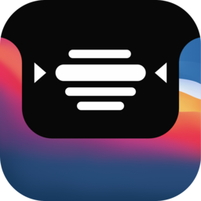

# NotchCue for macOS

A teleprompter that lives inside your MacBook's notch. Click it, it opens into a
scrolling text box right where the camera is — so you're always looking near
the lens instead of off to the side of the screen.

## Features

- **Notch-anchored pill UI** — collapses to a small pill in the notch, expands
  into the prompter (and back) with a tap
- **Multiple answers** — keep several scripts loaded and switch between them
  with prev/next, without leaving the notch
- **Four themes** — Dark, Light, and two Glass variants (a real frosted
  material, not a flat color, so whatever's behind the box shows through)
- **Fully custom keyboard shortcuts** — click any shortcut in Settings and
  press your own combo to rebind it; changes apply immediately
- **Voice activation** — starts and stops scrolling based on your mic input,
  no button presses needed
- **Hidden from screen recording** — toggle it invisible to screen shares and
  recordings while staying visible to you
- **Adjustable everything** — font (Default/Serif/Rounded/Monospaced), size,
  line spacing, alignment, scroll speed, top/bottom fade, width/height,
  multi-monitor screen selection
- **Menu-bar controlled** — no Dock icon; toggle visibility from the menu bar
  or a global hotkey

## Building

```bash
brew install xcodegen
xcodegen generate
open notch-cue.xcodeproj
```

Requires macOS 14+ and Xcode 15+. Dependencies (currently just
[HotKey](https://github.com/soffes/HotKey)) are pulled in automatically via
Swift Package Manager on first build.

